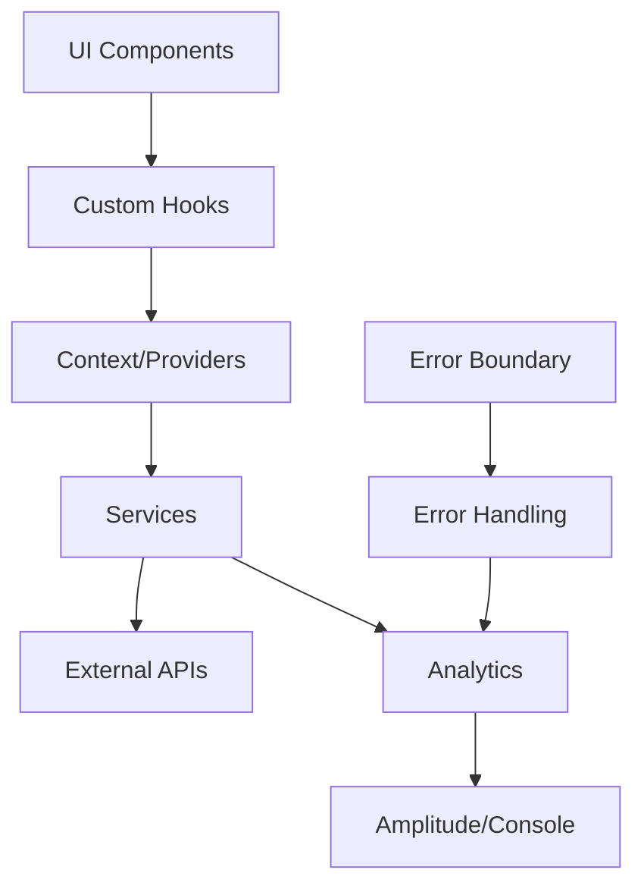

# Arquitetura Geral

## 🏗️ Visão Geral

O projeto segue os princípios da **Clean Architecture**, promovendo separação clara de responsabilidades e facilitando manutenibilidade e testabilidade.

## 📐 Camadas Arquiteturais

### 1. **Presentation Layer** (Apresentação)
- **Localização**: `src/components/`, `src/pages/`
- **Responsabilidade**: Interface do usuário e interações
- **Tecnologias**: React, TailwindCSS

```
pages/           # Páginas principais da aplicação
components/      # Componentes reutilizáveis
├── ErrorBoundary.tsx    # Captura de erros
├── LoadingSpinner.tsx   # Estados de loading
├── HouseCard.tsx        # Card das casas
└── ...
```

### 2. **Application Layer** (Aplicação)
- **Localização**: `src/hooks/`, `src/context/`
- **Responsabilidade**: Orquestração de casos de uso
- **Padrões**: Custom Hooks, Context Pattern

```
hooks/           # Lógica de negócio reutilizável
├── useHouses.ts      # Gerenciamento de casas
├── useAnalytics.ts   # Eventos de analytics
└── usePageTracking.ts # Rastreamento de páginas

context/         # Gerenciamento de estado global
├── HousesProvider.tsx  # Provider das casas
└── houses-context.ts   # Contexto tipado
```

### 3. **Infrastructure Layer** (Infraestrutura)
- **Localização**: `src/services/`
- **Responsabilidade**: Integrações externas e implementações
- **Padrões**: Dependency Injection, Strategy Pattern

```
services/
├── httpClient.ts           # Cliente HTTP abstrato
├── wizardWorldApi.ts       # API do Wizard World
├── container.ts            # Container de DI
└── analytics/              # Serviços de analytics
    ├── amplitudeService.ts
    └── consoleService.ts
```

## 🔄 Fluxo de Dados



## 🎯 Princípios Aplicados

### **SOLID Principles**

1. **Single Responsibility**: Cada classe/função tem uma única responsabilidade
2. **Open/Closed**: Extensível via interfaces (Analytics providers)
3. **Liskov Substitution**: Implementações intercambiáveis (HttpClient, Analytics)
4. **Interface Segregation**: Interfaces específicas e focadas
5. **Dependency Inversion**: Dependência de abstrações, não implementações

### **Clean Code**

- **Naming**: Nomes descritivos e intencionais
- **Functions**: Pequenas, focadas, sem efeitos colaterais
- **Comments**: Código auto-documentado
- **Error Handling**: Tratamento explícito e robusto

## 🔧 Padrões de Design

### **Dependency Injection**
```typescript
// Container centralizado
export const serviceContainer = new ServiceContainer({
  apiBaseUrl: 'https://wizard-world-api.herokuapp.com',
  enableAnalytics: true
});
```

### **Strategy Pattern** (Analytics)
```typescript
// Múltiplas estratégias de analytics
const getAnalyticsService = () => {
  switch (provider) {
    case 'amplitude': return new AmplitudeAnalyticsService();
    case 'console': return new ConsoleAnalyticsService();
    default: return new NoOpAnalyticsService();
  }
};
```

### **Observer Pattern** (Context API)
```typescript
// Estado observável com useReducer
const [state, dispatch] = useReducer(housesReducer, initialState);
```

## 📊 Benefícios da Arquitetura

### **Testabilidade**
- Injeção de dependência facilita mocking
- Hooks isolados são facilmente testáveis
- Componentes puros sem lógica de negócio

### **Manutenibilidade**
- Separação clara de responsabilidades
- Baixo acoplamento entre camadas
- Código auto-documentado

### **Escalabilidade**
- Fácil adição de novos providers
- Estrutura preparada para crescimento
- Reutilização de código

### **Performance**
- Code splitting por funcionalidade
- Lazy loading de componentes
- Otimizações de bundle