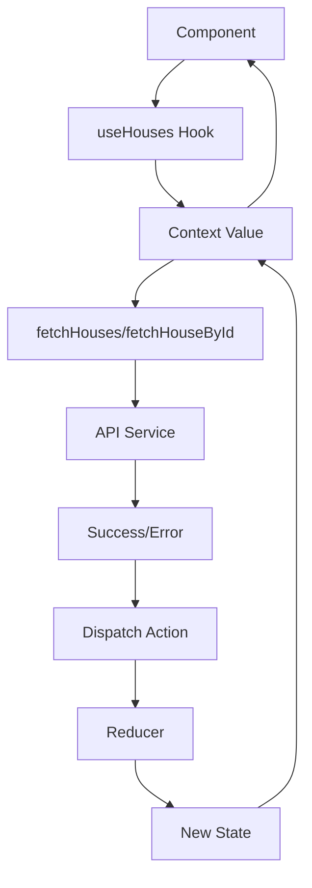

# Gerenciamento de Estado

## 🎯 Estratégia Adotada

O projeto utiliza **Context API + useReducer** para gerenciamento de estado global, seguindo padrões do Redux mas com uma implementação mais simples e adequada ao escopo da aplicação.

## 📊 Estrutura do Estado

### **HousesState**
```typescript
interface HousesState {
  houses: HouseDto[];           // Lista de casas
  selectedHouse: HouseDto | null; // Casa selecionada
  loading: boolean;             // Estado de carregamento
  error: ApiError | null;       // Erros da API
}
```

## 🔄 Actions e Reducer

### **Actions Types**
```typescript
type HousesAction =
  | { type: 'FETCH_HOUSES_START' }
  | { type: 'FETCH_HOUSES_SUCCESS'; payload: HouseDto[] }
  | { type: 'FETCH_HOUSES_ERROR'; payload: ApiError }
  | { type: 'FETCH_HOUSE_START' }
  | { type: 'FETCH_HOUSE_SUCCESS'; payload: HouseDto }
  | { type: 'FETCH_HOUSE_ERROR'; payload: ApiError }
  | { type: 'CLEAR_ERROR' }
  | { type: 'CLEAR_SELECTED_HOUSE' };
```

### **Reducer Pattern**
```typescript
function housesReducer(state: HousesState, action: HousesAction): HousesState {
  switch (action.type) {
    case 'FETCH_HOUSES_START':
      return { ...state, loading: true, error: null };
    
    case 'FETCH_HOUSES_SUCCESS':
      return { 
        ...state, 
        houses: action.payload, 
        loading: false, 
        error: null 
      };
    // ... outros cases
  }
}
```

## 🎭 Context Provider

### **Provider Centralizado**
```typescript
export function HousesProvider({ children }: HousesProviderProps) {
  const [state, dispatch] = useReducer(housesReducer, initialState);
  
  // Métodos síncronos através de callbacks
  const fetchHouses = useCallback(async () => {
    dispatch({ type: 'FETCH_HOUSES_START' });
    // ... lógica assíncrona
  }, [apiService, analytics]);
  
  return (
    <HousesContext.Provider value={contextValue}>
      {children}
    </HousesContext.Provider>
  );
}
```

## 🪝 Custom Hooks

### **useHouses Hook**
```typescript
export function useHouses() {
  const context = useContext(HousesContext);
  
  if (!context) {
    throw new Error('useHouses must be used within HousesProvider');
  }
  
  return context;
}
```

## 🏗️ Vantagens da Abordagem

### **Previsibilidade**
- Estado imutável via reducer
- Actions explícitas e tipadas
- Fluxo unidirecional de dados

### **Debugabilidade**
- Actions logáveis para debugging
- Estado centralizado e rastreável
- Integração fácil com DevTools

### **Testabilidade**
- Reducer puro e testável
- Context mockável em testes
- Hooks isolados

### **Performance**
- Re-renders otimizados
- useCallback para estabilidade
- Context splitting quando necessário

## 🔄 Fluxo de Dados



## 📈 Estado vs Props

### **Estado Global (Context)**
- Dados compartilhados entre componentes
- Estado da aplicação (casas, loading, errors)
- Dados que persistem entre navegações

### **Estado Local (useState)**
- Estado específico do componente
- Interações temporárias (hover, focus)
- Dados que não precisam ser compartilhados

### **Props**
- Comunicação parent-child
- Configuração de componentes
- Dados de apresentação

## 🛡️ Error Handling

### **Tratamento no Reducer**
```typescript
case 'FETCH_HOUSES_ERROR':
  return {
    ...state,
    houses: [],        // Reset em caso de erro
    loading: false,
    error: action.payload,
  };
```

### **Recovery Actions**
- `CLEAR_ERROR`: Limpa erros para retry
- `CLEAR_SELECTED_HOUSE`: Reset de seleção
- Retry automático com exponential backoff

## 🔮 Evolução Futura

### **Possíveis Melhorias**
- **RTK Query**: Para cache mais sofisticado
- **Zustand**: Para estado mais simples
- **React Query**: Para server state
- **Context Splitting**: Para performance em escala

### **Quando Migrar**
- Crescimento significativo da aplicação
- Necessidade de cache complexo
- Múltiplos contextos conflitantes
- Performance crítica